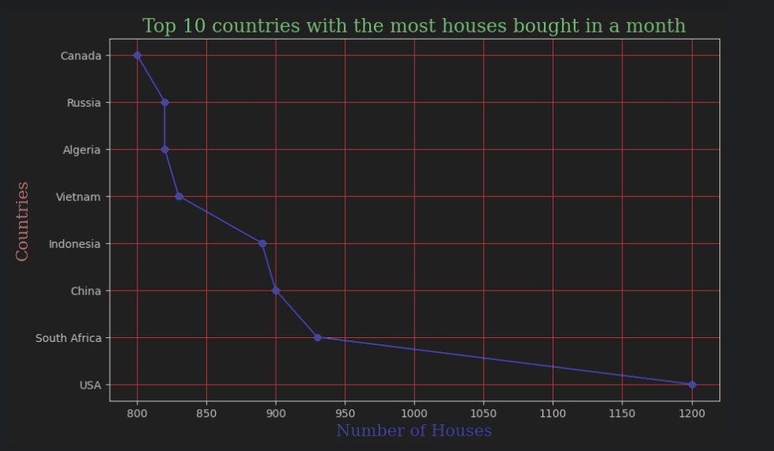

<h1> Data Visualization - Python Project</h1>
 
<h2>Features</h2>
<ul>
    <li> Houses bought per month in multiple countries </li>
    <li> Representing the top 10 countries with the most houses bought in a month </li>
    <li> Representing the bottom 10 countries with the most houses bought in a month </li>
    <li> Representing 10 countries randomly for houses bought in a month </li>
    <li> Representing 5 countries randomly from Top 10 Most Bought houses in a month </li>
    <li> Representing 5 countries randomly from Bottom 10 Bought houses in a month </li>
    <li> Plot, Scatter, Bar, Histogram & Pie Char Graphs </li>

</ul>

<h2>Acknowledgments</h2>

<b> Python3: http://bit.ly/python3-certifications </b>
 

<h2>Photo</h2>

 
<h2>Contact</h2>

<b> Email: mariusc0023@gmail.com </b>
